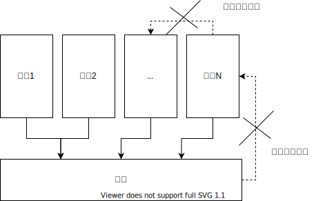

# 如何不 Review 每一行代码，同时保持代码不被写乱

本文的读者

* 你为代码总是被同事们写乱了而苦恼，但是又无法 Review 每一行代码
* 你要开发一个 SaaS，实现各种复杂功能的组合，但是又不能像互联网公司一样堆很多人来开发微服务
* 你模仿过主流的微服务，DDD 等做法，但并没有达到理想的效果，不介意尝试一些非主流的新办法

本文的目标是以尽可能浓缩的篇幅提供可模仿的步骤来达成“如何不 Review 每一行代码，同时保持代码不被写乱”的目标。总共三步

* 第一步：不要拆分代码仓库，不要拆微服务。Monorepo is all you need，Feature Toggle is all you need。
* 第二步：管控集成类需求的代码审查：主板加插件。
* 第三步：管控规范型需求的代码审查：独家垄断。

# 第一步：不要拆分代码仓库，不要拆微服务

拆分微服务以及代码仓库的缺点

* 利用组织边界来强化代码的分工边界会导致将来调整阻力很大。我们对于代码应该如何组织的认识是随着新需求不断调整的。不要轻易动用“组织架构”这样的核武器来达成小目标。
* 拆分了代码仓库之后不利于在编译期做集成，做集成后的整体验证。即便运行时集成有万般好处，也没有必要丧失掉编译期集成的选项。
* 跨代码仓库的代码阅读，开发时的辅助和检查都会变困难。
* 微服务控制变更风险的灰度边界是固化的，也就是微服务的大小。切得越细，每次变更的东西就越少，风险就越小。这不够灵活。
* 微服务的弹性边界是固化的，如果某种视频编辑需要特别多的内存，我们希望独立伸缩，就得把这部分代码切割出来变成一个独立的微服务。

拆分微服务和代码仓库相比单体架构，最重要的目标是减少分支冲突，控制发布变更的风险。但是拆分微服务和代码仓库并不是最佳的解决方案。Monorepo + Feature Toggle 是更好的解决方案。

* Monorepo：所有的代码都在一个仓库里。这样就不存在不同模块的仓库有不同的版本问题。大家都是统一的一个版本。升级线上系统的过程拆分成：部署+发布，两个步骤。部署的时候，整个 Monorepo 的代码都部署到目标机器上了，但并不代表发布了。
* Feature Toggle：特性开关来精确控制哪些逻辑分支被发布出去。这样部署就和发布解耦了。要灰度多少比例，可以精确控制。要一个特性开关的两个版本的逻辑分支共存，也可以实现。

使用 Monorepo + Feature Toggle 可以提供所有拆分微服务达成的目标，同时克服以上微服务拆分带来的缺点

* 通过目录结构来控制代码所有权。你可以要求这个目录下的代码必须经过你的 Code Review。调整目录结构比调整代码仓库容易得多，比调整组织架构要容易得多。
* 可以保持编译期集成这个选项。
* 可以更容易实现开发时辅助和检查工具，可以很方便地阅读跨模块的代码
* 变更风险更小，不仅仅开关回滚很快，而且开关可以灵活地定向灰度，而且一个开关的控制范围大小也可大可小，粒度非常灵活。
* 弹性边界更灵活，不需要因为要独立扩缩容，就得把代码切分出去

经常听说的一个说法是最终是要拆分成微服务，多仓库的。单体应用单仓库只是一个过度形态。这会导致我们认为为啥步一步到位呢。但事实并非如此，微服务和多仓库并不一定适合所有人。你可以用 Monorepo + Feature Toggle 用一辈子。

具体如何实践 Monorepo + Feature Toggle 按照 https://www.branchbyabstraction.com/ 和 https://trunkbaseddevelopment.com/ 的指导去做就可以了。

# 第二步：管控集成类需求的代码审查

当我们把代码都放一个代码仓库里之后，立即要面临的问题是代码不会写乱么？你怎么控制什么代码写在哪里？每一行代码写之前都来问你，每一行代码写完了都需要你来 Review 么？

所以，我们需要一种强制检查代码写在了正确的位置的自动化机制。这个机制就叫“依赖管理”。对应常见的编程语言

* 如果是 TypeScript，这个叫 package.json
* 如果是 Golang，这个叫 go.mod
* 如果是 Java，这个叫 POM.xml

当我们把代码拆分成多个包（或者叫模块），并使得这些包（模块）形成特定的依赖关系，就可以通过编译器检查控制什么代码必须写在什么地方，从而不需要靠人去检查。这个依赖关系如下图所示

* 插件：尽可能完整的实现一个独立的功能，比如面向最终用户的完整的页面
* 主板：当插件与插件之间有功能上的集成需要的时候，通过绕路主板来实现，而不能直接在插件和插件之间有引用关系

这样做的好处是可以减少 Review 的负担。不需要盯着每一行代码了，只需要重点盯着主板的修改就可以了。实现的步骤是

* 先决定每个插件里封装什么的数据库表。如果是前端模块，则是封装什么后端的数据接口
* 因为插件不能引用插件，所以对应的页面和功能就会自然选择有这些数据库表的插件里来写。因为写在其他插件里的话就访问不到了
* 然后对于需要来自多个插件数据才能实现的功能，我们通过主板来实现

比如说我们决定有一个团购插件，有一张表 GroupPurchaseCampaign 记录了团购活动的参与商品和规则。那么要展示团购活动列表的时候，就会自然有限选择在团购插件里来写，因为这个插件里可以访问这张表。这里说的“访问”是指可以 import GroupPurchaseCampaign 这个类型的意思。插件不能 import 另外另外一个插件定义的类型，但是不意味着运行时不能访问别的插件的数据。运行时的数据都是通的。限制的是编译期，谁可以 import 谁。

当需要主板进来实现”集成类需求”的时候，应该如何做。分为以下三类

* 一个界面需要同时展示来自两个插件的数据。例如商品详情页，需要常规商品数据，需要当前的券活动，需要当前的限时折扣活动等。在主板里把界面分成多个槽，然后不同的槽由不同的插件来实现。
* 一个操作需要多个插件的数据进行综合决策判断。例如计算价格的函数，需要综合商品的原价，需要取得购物车选择券，需要判断是否满减等。在主板里把价格的计算流程里留出槽，然后不同的槽由不同的插件来实现。
* 一个插件的界面里需要展示来自其他插件的数据。例如退款申请界面，需要展示商品图片等。这个不同之处在于整个页面绝大部分都是由一个插件自己实现的，只是在局部的地方需要其他插件的数据。所以就不值得把整个页面都下沉到主板里去写。实现方法是在主板里声明一个ProductCard组件，然后这个组件由常规商品插件实现，再由退货插件来使用用。

主板起到的作用和 C 编程里的“头文件”的作用是一样的，就是给模块之间相互调用提供声明。技术上如何实现：在一个包里提供声明，再另外一个包里写实现。这个有两类做法：

* 通过运行时多态来实现。在主板里定义 interface，在插件里写实现 interface 的类的或者函数。然后在启动的时候，做一次 “AutoWire” 的绑定操作。这个绑定最简单的方式可以是对类型为函数指针的全局变量做一下赋值操作。也可以由 Spring 这样的依赖注入框架来做 AutoWire。
* 通过编译期做源代码的复制粘贴。需要在编译之前先对源文件做一下处理，然后再喂给编译器。

无论是哪种具体实现技术，都不要实现成如下图所示这样

在插件之上**没有**一个额外的包（模块）包含业务逻辑了。插件对主板的插入应该是一个 AutoWire，纯机械不含业务的过程。业务编排这样的概念一定不要出现在依赖关系的最顶层。我们已经在最底下的主板实现了所谓的“业务编排”了。

# 第三步：管控规范型需求的代码审查

有了主板加插件，Monorepo 已经切分出了多个子目录了。每个开发者也基本上能够知道什么需求写在什么目录下，哪些目录是自己经常修改的。接下来的问题是，如果每个开发者都各写各的，那他们之间有重复实现怎么办？谁来避免同一个东西，被不同产品经理提出多遍，再由不同的开发者用不同的姿势实现多变，导致浪费和返工？这个也是一个 Code Review 的问题。不能指望有一个人来 Review 每一行代码。
