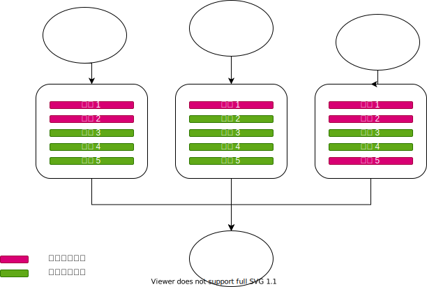

一致性指标是对“相乘组合关系”的Git仓库的额外要求，是为了防御常见的设计错误：

* 过度抽象：强行把一堆不相关的东西拧巴到一起。所以引入了“必要参数占比”和“咨询量”这两个指标。
* 过早抽象：没想清楚的情况下，根据局部的一两处重复就抽出一个可复用的东西。所以引入了“使用次数”，“使用率”和“阻断率”这三个指标。

# 必要参数占比

我们把可复用Git仓库对外提供的函数参数分为两类，必要参数和非必要参数。非必要参数的计算口径是只有 10% 的调用方传递了的参数。

指标为必要参数的数量占总参数数量的占比。为了抽取出可复用的模块是不是做得过度了？是不是把一些小众场景的具体业务也以额外参数的方式 pull down 到可复用Git仓库里了。
每一个额外参数都增加了调用者的负担，是额外的学习和维护成本。

# 咨询量

当一个定位为“可复用模块”的团队，是孤单寂寞的。如果被拉去参与了某重点项目的 Feature Team，那是莫大的荣耀。
但是为了保证 Consistency，可复用的 Git 仓库，应该努力降低使用者的成本。
使用者的最大成本来自于沟通问询。如果文档不清楚，接入开通方式是手工的，必然会体现在咨询量上。

咨询量这个指标怎么计算就很难说得清楚了。在不同的团队里，咨询量的体现方式各有不同。总之这个指标就是越接近零越好。

# 接入次数

使用次数只有1次或者2次，就不应该被抽取成可复用的Git仓库。至少要被使用3次。

# 接入率

不认为去识别“代码重复率”是有意义的指标。代码重复并不一定是问题，很难说今天是一模一样的代码，明天还会保持一模一样。不管三七二十一的“复用”反而可能造成耦合，降低团队自主性（Autonomy）。
一个典型的反面案例就是 utils 包，utils 类。没有人说得清楚啥时候要用你抽取出来的这个 utils 类，也说不清楚啥时候不应该用。
如果要抽出可复用的代码，出发点应该是 consistency，是在团队关键成员达成了一致之后的有意识行为。

每个可复用的Git仓库，要定义清楚自己的适用范围。在适用范围内需要度量接入率。如果说不清楚啥情况该复用，啥情况不该复用的东西，就应该当成一次性的业务逻辑，不要让其他Git仓库对其产生依赖关系。
接入率基于代码扫描自动计算，可接入的通过 pattern match 算得，已接入的直接看代码符号的引用关系。

# 阻断率

当我们使用了 Java 这样的编程语言的时候，Java 会阻断你在代码中使用汇编语言直接操纵 CPU。这是比较典型的“阻断”。
阻断是最强有力地保障一致性的措施。

如果使用了 C++ 这样的编程语言，很有可能 Git 仓库之间对什么是一个 string 都没有共识。
这样就必须要在一定范围内（比如某个项目，某个部门），强制要求所有的 Git 仓库都接入同样的 string 库，从而保证互操作的低摩擦。

类似的，一个彼此互相RPC调用的分布式应用，各个进程都用不同的 RPC 协议，用不同的 RPC 实现库来互相通信会导致很多问题。
例如，A调用B又调用C，一旦调用失败，层层加码地去重试，就可能导致最底层模块被反复重试，最终被击垮。
解决办法是需要分布式调用链上的所有进程都遵循同样的重试规则。
如果没有办法“阻断”手撸RPC的实现，看见一个http url，就直接随意找个 http 库去调用，那就很难保证重试规则的一致性。

阻断率指所有可接入的地方，有多少处上了强制检查，确保了违规行为会被阻断。

