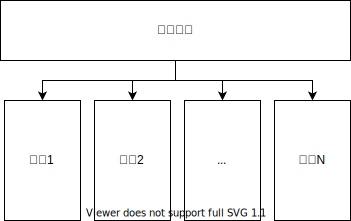
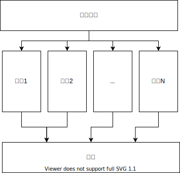
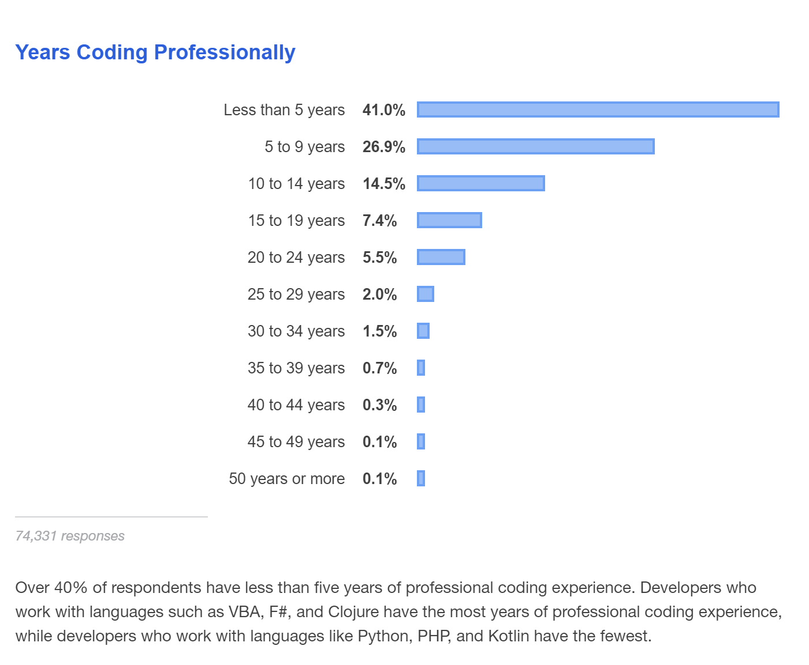

# 信息隐藏

通过信息隐藏，我们把代码分为“可以随便写的”和“不可以随便写的”两部分。从而控制代码腐化的蔓延。

## Class 的信息隐藏

我们都知道 Class 有一个叫封装的概念。把 Field 和 Method 分为 Public / Private / Protected 三种。通过只暴露 Public 成员，我们就把 Private 和 Protected 成员给隐藏起来了。


如果有如下的代码

```java
public double Area(object[] shapes) {
    double area = 0;
    foreach (var shape in shapes) {
        if (shape is Rectangle) {
            Rectangle rectangle = (Rectangle) shape;
            area += rectangle.Width * rectangle.Height;
        } else {
            Circle circle = (Circle)shape;
            area += circle.Radius * circle.Radius * Math.PI;
        }
    }
    return area;
}
```

根据“开闭原则”（Open Closed Principle），好的代码应该尽量 Open for extension，Close for modification。也就是说，如果

```java
if (shape is Rectangle) {
    // ...
} else if (shape is Circle) {
    // ...
} else if
    // ...
}
```

这样一直修改这个 if/else 是不好的代码。好的做法是把 Rectangle 的 Width/Height 隐藏起来，把 Circle 的 Radius 也隐藏起来。

```java
public double Area(Shape[] shapes) {
    double area = 0;
    foreach (var shape in shapes) {
        area += shape.Area();
    }
    return area;
}
```

从依赖关系上来看，就是如下图所示


这样我们就把代码分为上下两部分。对于 Rectangle，Circle 以及 AreaCalculator 来说，彼此都不知道对方的存在。
也就是大家都依赖 Shape，但是彼此没有依赖关系。

## Git 仓库的信息隐藏

Class 有封装和依赖关系。Git 仓库也有封装和依赖关系。


在上图中，B和C是互相隐藏的。B的实现细节对C隐藏了，C的实现细节对B也隐藏了。
我们都使用过 visual studio code，其插件化架构就类似上面的依赖关系。[通过新增插件来实现功能的扩展](../VscodeExample/README.md)。

我们可以把这种做法更一般的描述为“主板+插件”。


容易写出幺蛾子的代码都是集中在一个（主板）Git仓库里的。
在做 Code Review 的时候，只需要重点观照倒置到底层的集成Git仓库是否合理。
所谓合理，就是能不改就不改。除非不开槽，不开扩展点，需求在插件中无法实现了。

“主板+插件”不仅仅可以写 Visual Studio Code 这样的 IDE，对于各种类型的业务系统都是同样适用的。
只是 VsCode 可能一个插件点上可以有多个插件，而业务系统上一般不会有那么多彼此可替换的插件，更多是一个萝卜一个坑的搞法。
主板部分一定要尽可能的小，要不然就会变成所有的需求都要堆到主板里去实现了。

这种写法和上面的“Class信息隐藏”是不是一回事？从倒置的角度是一回事。但是区别是基于 Class 的依赖倒置缺乏编译器的保障，无法确保插件之间不互相引用。


这两个禁止才是关键。

* 禁止主板Git仓库反向依赖插件Git仓库
* 禁止插件Git仓库之间互相依赖

## 如何实践，这玩意真能写业务？

理论上看起来很美好，然而有两个问题

* [主板+插件的技术方案有哪些选择？](../DependencyInversion/README.md)
* [对应具体的业务需求，怎么拆分出主板和插件来？](../Integration/README.md)
    * [离散型 UI](../Integration/DiscreteUI/README.md)
    * [混合型 UI](../Integration/MixedUI/README.md)
    * [离散型流程](../Integration/DiscreteProcess/README.md)
    * [混合型流程](../Integration/MixedProcess/README.md)
    * [产品族](../Integration/ProductFamily/README.md)
    * [领先技术](../Integration/Library/README.md)

最后我们来看一个[亚马逊商城的综合案例](../AmazonExample/README.md)。

## 不倒置可不可以？

是不是不依赖倒置就不能写插件呢？比如，这个样子是不是也是一样的



这样不一样可以把代码都写在插件里吗？在最上层加一个“业务编排”，和所谓的“主板”不是同样的概念吗？
这样的问题是插件与插件之间没有互相的依赖关系怎么能实现业务需求呢？比如在成交了之后分佣，分佣插件怎么知道啥叫成交呢？这种写法的大概率后果是更频繁地需要改动“业务编排”Git仓库，从而使之成为瓶颈。然后又逐步发展成下面这个模式：



如果不搞出一个主板，允许彼此插件之间互相调用那会更加混乱。相比上面有一个“业务编排”，下边有一个“主板”。那似乎把“业务编排”去掉更简单一些。

那我们只要一个主板吗？并不是这样的，主板的需求来自于 UI 界面的耦合，以及混合流程的耦合。
如果两个业务需求都有完全独立的界面，流程上可以拆分为事件驱动的，那完全就没有必要插到一个主板上，可以是完全独立的微服务，甚至是独立的产品（独立的SaaS）。
比如说我们有一个主板承载了商城订单的界面和流程，来了一个淘宝商品搬家的需求。
这个淘宝商品搬家有独立的UI，只需要商城开个写入商品的接口就可以完成需求。
类似这样的需求就没有必要商城提供什么插件和主板，然后通过主板来搞什么界面和流程集成。
简单搞个开放API，需要搬家的时候商品搬家调用一下商城的开放API就好了。
说到底是业务逻辑内在联系是否紧密，如果当成两个独立产品一样来开发和售卖，那自然是最理想的情况。

## 为何信息隐藏可以代码防腐？

David Parnas 在 1971 年就写了 [On the Criteria To Be Used in Decomposing Systems into Modules](http://sunnyday.mit.edu/16.355/parnas-criteria.html)，以上信息隐藏的做法基本上已经得到程序员的认可。但是我们看下图



50年来，大量的新人不断地涌入这个行业。如果指望一个项目上所有的人都能遵守很高的标准，能够独立对“好”和“坏”的设计做正确的判断，这是不现实的。并不是说软件工程教育不重要，教育仍然是要做的。但是仅仅靠教育来提高软件工程的质量是不现实的。


如上图所示的“信息隐藏”的做法，其实质是为了“代码防腐”。在这样的依赖关系下，插件的 Git 仓库是不会造成全局的影响的。这样我们就可以放心的把新人分配去写一个独立的插件，而不用担心其设计选择造成大面积的代码腐化。Code Review 仅需要集中关照主板。并且评价“高内聚低耦合”的标准也可以用主板的代码行数进行量化（在完成需求的前提下，主板的代码行数越少就是越好）。

## 编译期组装主板和插件的实现方案

不同的语言和编译工具链，实现方案会有所不同

* TypeScript + Vite: https://github.com/taowen/vite-ioc-demo/
* TypeScript + NPM: https://github.com/taowen/npm-ioc-demo/
* TODO: 补充更多的语言和编译工具链的实现方案
